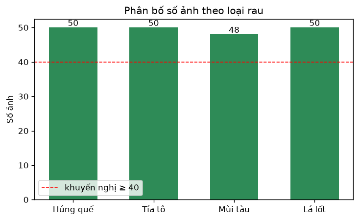
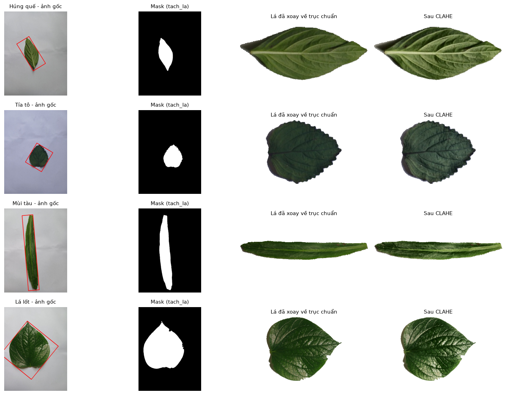
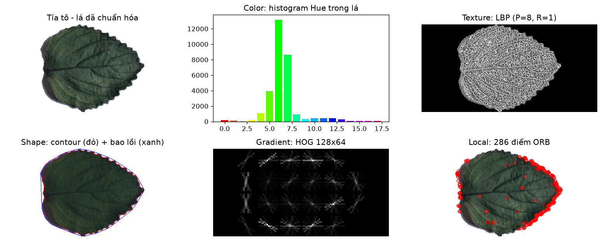
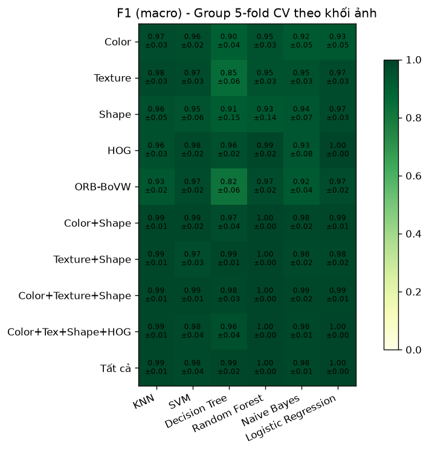
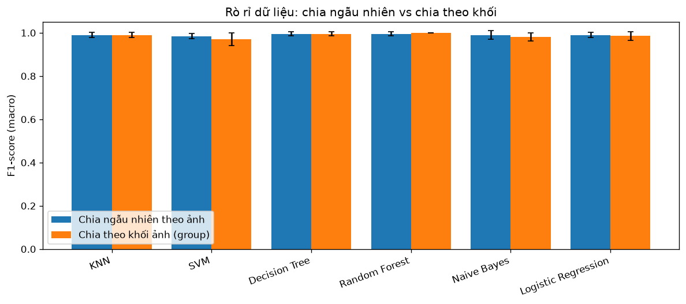
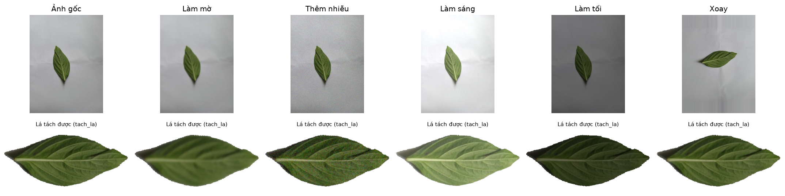
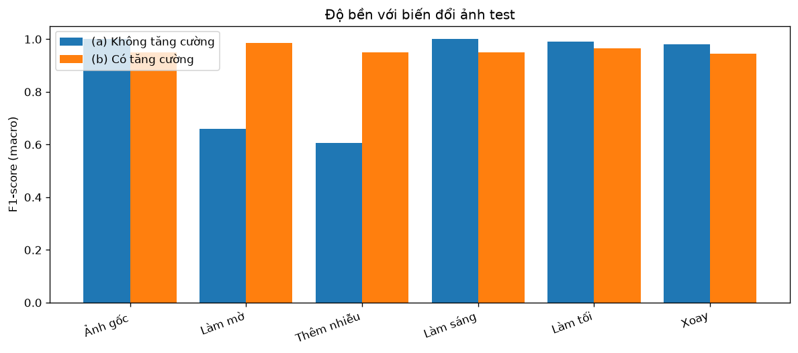
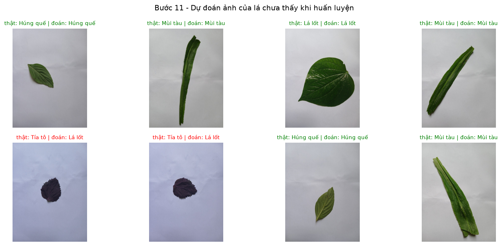
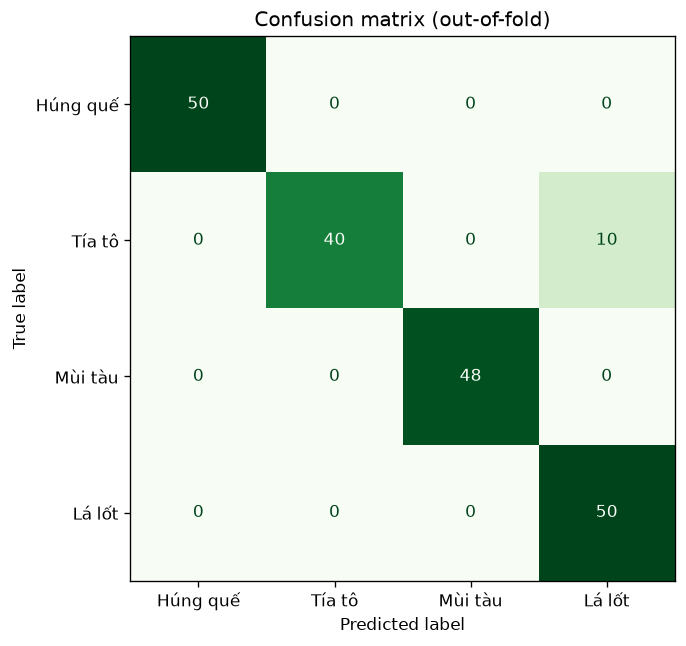
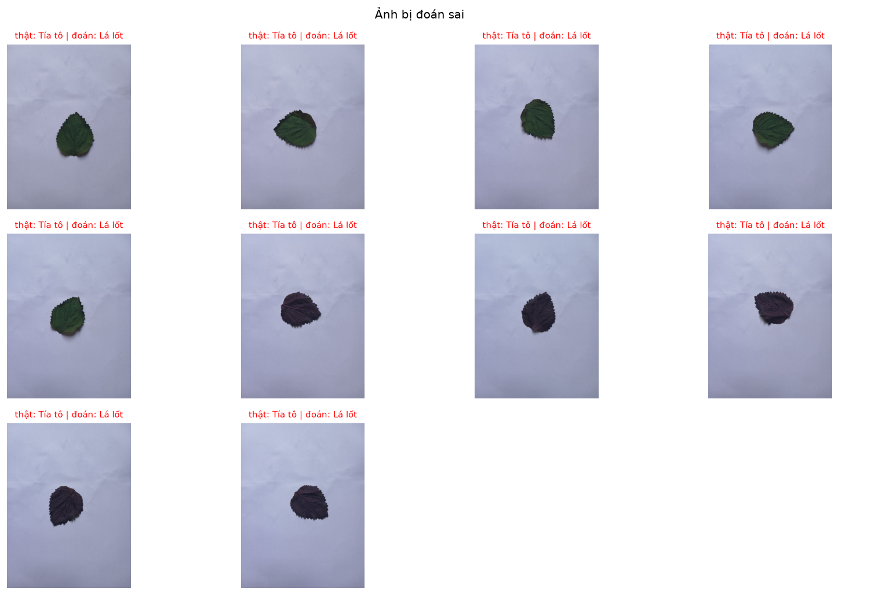

# Bài tập Chương 3 – Nhận dạng 4 loại rau thơm từ ảnh lá

**Học phần:** Thị giác máy tính (IT1.653.3)
**Yêu cầu:** áp dụng quy trình 12 bước của hệ thống nhận dạng truyền thống cho một bài toán cụ thể, tự thu thập dữ liệu, thử nghiệm nhiều kịch bản, mô tả từng bước và đánh giá kết quả.

**Kết quả chính:** mô hình cuối (đặc trưng Texture + Shape, Random Forest, có tăng cường dữ liệu) đạt **Accuracy 0,949 / F1 0,949** trên 198 ảnh, đánh giá bằng *group 5-fold cross-validation* (ảnh test luôn thuộc khối mà mô hình chưa từng học). Toàn bộ 10 ảnh sai là cùng một chiếc lá tía tô bị nhầm thành lá lốt.

| File | Nội dung |
|---|---|
| [nhan_dang_rau_thom.py](nhan_dang_rau_thom.py) | Toàn bộ pipeline 12 bước và 5 kịch bản thử nghiệm |
| [du_doan.py](du_doan.py) | Dự đoán ảnh mới bằng mô hình đã lưu (dòng lệnh) |
| [demo_web.py](demo_web.py) | Giao diện web demo: `python demo_web.py` → http://127.0.0.1:8501 |
| [dataset/](dataset/) | 198 ảnh tự chụp (bản thu nhỏ 800px) |
| [results/](results/) | Biểu đồ, bảng CSV, log đầy đủ ([log.txt](results/log.txt)), mô hình `model.joblib` |

Chạy lại: `python nhan_dang_rau_thom.py` (khoảng 16 phút trên CPU, lần sau dùng cache nhanh hơn); dự đoán ảnh mới: `python du_doan.py <ảnh hoặc thư mục> --show`.

---

## Bước 1 – Xác định bài toán và lớp đối tượng

| Câu hỏi (slide 18) | Trả lời |
|---|---|
| Đối tượng cần nhận dạng | Lá rau thơm |
| Số lớp | 4: Húng quế, Tía tô, Mùi tàu, Lá lốt |
| Ý nghĩa mỗi lớp | Một loại rau, gồm cả mặt trên và mặt dưới lá |
| Đầu vào | Ảnh đơn chụp bằng điện thoại |
| Số đối tượng / ảnh | Một lá, đặt trên giấy trắng |
| Classification hay detection | Classification (vị trí lá chỉ dùng để tách ROI ở bước 5) |

**Ứng dụng:** cân tự tính tiền ở siêu thị (rau không có mã vạch, nhân viên phải tra mã thủ công), ứng dụng hỗ trợ người đi chợ phân biệt các loại rau dễ nhầm.

**Đặc điểm phân biệt:**

| Loại | Hình dạng | Màu | Bề mặt |
|---|---|---|---|
| Húng quế | Bầu dục nhọn | Xanh đậm | Bóng, mép gần như trơn |
| Tía tô | Bầu dục rộng, mép răng cưa | Mặt trên xanh, **mặt dưới tím** | Có lông tơ |
| Mùi tàu | Rất dài, hẹp (tỉ lệ dài/rộng ≈ 4–7) | Xanh nhạt | Mép có gai |
| Lá lốt | Hình tim, gần tròn (tỉ lệ ≈ 1,1) | Xanh thẫm | Rất bóng, gân nổi |

Cặp dễ nhầm nhất dự kiến là **Húng quế – Tía tô** (cùng dáng bầu dục, mặt trên tía tô cũng màu xanh).

## Bước 2 – Thu thập và tổ chức dữ liệu

- Rau mua ở chợ; mỗi loại 4–5 lá, mỗi lá chụp khoảng 10 ảnh (xoay nhiều hướng, cả hai mặt) bằng điện thoại, trên giấy A4 trắng, ngày 03/10/2026.
- Đã loại 2 ảnh mùi tàu có ngón tay lọt vào khung. Giữ lại các ảnh lá rách/thủng (đa dạng hóa dữ liệu).
- Tổng cộng **198 ảnh**: Húng quế 50, Tía tô 50, Mùi tàu 48, Lá lốt 50 (cân bằng).
- Ảnh gốc 50MP (8160×6120, tổng 2,3 GB) được thu nhỏ về cạnh dài 800px để lưu trữ và xử lý.

```
dataset/
├── hung_que/  hung_que_01.jpg … hung_que_50.jpg
├── tia_to/    tia_to_01.jpg   … tia_to_50.jpg
├── mui_tau/   mui_tau_01.jpg  … mui_tau_48.jpg
└── la_lot/    la_lot_01.jpg   … la_lot_50.jpg
```

Tên file được đánh số **theo thứ tự chụp** – thông tin này được dùng ở bước 9.



**Hạn chế của dữ liệu:** chỉ có 4–5 lá mỗi loại, chụp trong cùng một buổi, cùng nền và ánh sáng. Mô hình vì vậy có nguy cơ "nhớ từng chiếc lá" thay vì học đặc điểm của loài – vấn đề này được xử lý ở bước 9 và kiểm chứng ở kịch bản 4.

## Bước 3 – Gán nhãn dữ liệu

Nhãn lấy theo tên thư mục và mã hóa thành số: `hung_que = 0`, `tia_to = 1`, `mui_tau = 2`, `la_lot = 3`. Bảng nhãn đầy đủ (kèm khối dùng cho cross-validation) ở [results/buoc03_nhan.csv](results/buoc03_nhan.csv).

## Bước 4 – Tiền xử lý ảnh

1. **Resize:** giải mã JPEG ở 1/4 độ phân giải rồi thu về cạnh dài 800px.
2. **Lọc Gaussian** (5×5) trước khi tách lá để giảm nhiễu vân giấy.
3. **CLAHE trên kênh L (không gian Lab):** cân bằng histogram cục bộ để giảm ảnh hưởng của ánh sáng; chỉ tác động lên độ sáng nên không làm sai màu lá.
4. **Chuyển ảnh xám** cho các đặc trưng Texture / HOG / ORB.

## Bước 5 – Xác định vùng đối tượng (tách lá)

1. Ước lượng màu nền từ viền ảnh (trung vị các pixel viền, không gian Lab).
2. Tính khoảng cách màu từng pixel tới màu nền, **kênh độ sáng L nhân trọng số 0,4** – bóng đổ của lá trên giấy chỉ tối hơn chứ không đổi màu, nên ít bị nhận nhầm là lá.
3. Ngưỡng **Otsu** → morphology (open, close) → giữ **vùng liên thông lớn nhất** và lấp lỗ (vết phản chiếu trên lá bóng).
4. **Chuẩn hóa tư thế:** PCA trên các pixel của lá → xoay để trục dài nằm ngang; lật để nửa có diện tích lớn hơn luôn ở bên trái/bên trên. Mọi lá về cùng một tư thế – quan trọng cho HOG.
5. Đặt lá vào khung 384×192 giữ nguyên tỉ lệ, nền ngoài lá tô trắng.

**Kết quả: tách được lá ở 198/198 ảnh**, và ở 198/198 ảnh sau mỗi phép biến đổi (mờ, nhiễu, sáng, tối, xoay).



Lưới toàn bộ lá đã tách của từng loại: [results/roi/](results/roi/).

## Bước 6 – Trích chọn đặc trưng

| Nhóm | Phương pháp | Số chiều | Phân biệt được |
|---|---|---|---|
| **Color** | Histogram HSV (18+8+8 bin) + mean/std/skew từng kênh, chỉ trên pixel của lá | 43 | Mặt dưới tím của tía tô; xanh nhạt của mùi tàu |
| **Texture** | LBP uniform (P=8,R=1 và P=16,R=2) + GLCM (contrast, dissimilarity, homogeneity, energy, correlation) | 33 | Gân nổi lá lốt, lông tơ tía tô, bề mặt bóng húng quế |
| **Shape** | Độ tròn, tỉ lệ dài/rộng, extent, solidity, convexity, eccentricity, **số răng cưa** (convexity defects), 7 Hu moments, 10 **Fourier descriptors** | 24 | Lá tim (lá lốt) vs lá dài (mùi tàu); mép răng cưa (tía tô, mùi tàu) |
| **Gradient** | HOG trên lá 128×64 (ô 16×16, khối 2×2, 9 hướng) | 756 | Bố cục gân và mép lá theo vùng |
| **Local** | ORB (300 điểm) + Bag of Visual Words (k-means 100 từ, học **chỉ trên tập train** của từng fold) | 100 | Bất biến xoay, chịu được lá rách |

Đặc trưng màu và texture chỉ tính trên pixel thuộc lá (mask), texture còn bỏ dải biên lá–nền.



Minh họa cho các loại còn lại: [húng quế](results/buoc06_dac_trung_hung_que.png), [mùi tàu](results/buoc06_dac_trung_mui_tau.png), [lá lốt](results/buoc06_dac_trung_la_lot.png).

## Bước 7 – Kết hợp các đặc trưng

Thử nghiệm 10 tổ hợp: từng nhóm riêng lẻ (5), Color+Shape, Texture+Shape, Color+Texture+Shape, Color+Texture+Shape+HOG, và Tất cả. Kết quả ở kịch bản 1.

## Bước 8 – Chuẩn hóa và giảm chiều

Chuẩn hóa (Standardization / Min-Max) và PCA (giữ 95% phương sai) nằm trong `sklearn.Pipeline`, chỉ được *fit* trên tập train của mỗi fold rồi áp dụng nguyên cho tập test. Kết quả ở kịch bản 2.

## Bước 9 – Chia tập dữ liệu: Group K-fold Cross-Validation

**Vấn đề:** mỗi lá có khoảng 10 ảnh gần giống nhau. Nếu chia train/test ngẫu nhiên theo ảnh, ảnh của cùng một lá rơi vào cả hai tập → mô hình chỉ cần nhớ chiếc lá → kết quả cao ảo (vi phạm yêu cầu *tổng quát hóa* ở slide 16).

**Giải pháp:**
- Vì ảnh được chụp lần lượt từng lá, mỗi lớp được chia thành **5 khối ảnh liên tiếp** theo thứ tự chụp (ảnh 01–10, 11–20, …). Với tía tô, mỗi khối trùng đúng một chiếc lá (kiểm tra bằng mắt); với các loại còn lại đây là xấp xỉ – ảnh của một lá có thể lấn sang khối kề ở chỗ chuyển lá.
- **Group 5-fold CV:** fold *k* lấy khối *k* của mọi lớp làm test (~40 ảnh), 4 khối còn lại làm train (~158 ảnh).
- **Nested CV:** siêu tham số được chọn bằng CV *bên trong* tập train (cũng theo khối); khối test của vòng ngoài không tham gia việc chọn.
- Báo cáo **trung bình ± độ lệch chuẩn F1 (macro)** qua 5 fold, và dự đoán *out-of-fold* cho từng ảnh.

Phương án này thay cho chia cố định 70/15/15: với 198 ảnh, mỗi lớp chỉ còn 7–8 ảnh test (1 lá) – kết quả phụ thuộc quá nhiều vào việc lá nào rơi vào test.

## Bước 10 – Huấn luyện với các bộ phân lớp

6 bộ phân lớp, mỗi bộ có lưới siêu tham số được chọn bằng nested CV:

| Bộ phân lớp | Lưới tham số |
|---|---|
| KNN | k ∈ {1,3,5,7}, weights ∈ {uniform, distance} |
| SVM (RBF) | C ∈ {1,10,100}, γ ∈ {scale, 0,001} |
| Decision Tree | max_depth ∈ {None, 10, 20} |
| Random Forest (200 cây) | max_features ∈ {sqrt, 0,2} |
| Naive Bayes (Gauss) | var_smoothing ∈ {1e-9, 1e-6, 1e-3} |
| Logistic Regression | C ∈ {0,1, 1, 10} |

### Kịch bản 1 – Đặc trưng × bộ phân lớp (F1 trung bình, group 5-fold CV)

| Đặc trưng | KNN | SVM | Decision Tree | Random Forest | Naive Bayes | Logistic Regression |
|---|---|---|---|---|---|---|
| Color | 0.970 | 0.964 | 0.904 | 0.955 | 0.920 | 0.929 |
| Texture | 0.980 | 0.975 | 0.850 | 0.950 | 0.954 | 0.975 |
| Shape | 0.960 | 0.945 | 0.913 | 0.926 | 0.935 | 0.975 |
| HOG | 0.959 | 0.980 | 0.959 | 0.990 | 0.934 | **1.000** |
| ORB-BoVW | 0.933 | 0.974 | 0.820 | 0.969 | 0.919 | 0.969 |
| Color+Shape | 0.990 | 0.990 | 0.969 | **1.000** | 0.985 | 0.995 |
| Texture+Shape | 0.990 | 0.970 | 0.995 | **1.000** | 0.980 | 0.985 |
| Color+Texture+Shape | 0.995 | 0.990 | 0.985 | **1.000** | 0.990 | 0.995 |
| Color+Tex+Shape+HOG | 0.995 | 0.981 | 0.959 | **1.000** | 0.985 | **1.000** |
| Tất cả | 0.995 | 0.981 | 0.989 | **1.000** | 0.985 | **1.000** |



**Nhận xét:**
- Từng nhóm riêng lẻ đạt 0,82–1,00; HOG mạnh nhất (vì lá đã được xoay về tư thế chuẩn ở bước 5, bố cục gradient rất ổn định).
- **Kết hợp đặc trưng (bước 7) cải thiện rõ rệt**: mọi tổ hợp có Shape cùng Color hoặc Texture đều đạt ≥ 0,97 với hầu hết bộ phân lớp. Các nhóm bổ sung cho nhau – Shape tách lá lốt / mùi tàu, Color và Texture tách húng quế / tía tô.
- Decision Tree yếu và kém ổn định nhất (một cây dễ quá khớp); Random Forest (nhiều cây) khắc phục được.
- Nhiều cấu hình đạt 1,000 → chọn cấu hình ít chiều nhất trong số đó: **Texture+Shape + Random Forest (57 chiều)**. Lưu ý: 1,000 ở đây phản ánh độ khó của dữ liệu hiện có (ít lá, cùng điều kiện chụp), không có nghĩa mô hình hoàn hảo – xem kịch bản 5 và bước 12.

### Kịch bản 2 – Chuẩn hóa và giảm chiều (Texture+Shape, Random Forest)

| Cách chuẩn hóa | F1 |
|---|---|
| Standardization | 1.000 ± 0.000 |
| Không chuẩn hóa | 1.000 ± 0.000 |
| Min-Max | 1.000 ± 0.000 |
| Standardization + PCA 95% | 0.959 ± 0.042 |

Random Forest không phụ thuộc thang đo đặc trưng (mỗi nút chỉ so sánh ngưỡng trên một chiều), nên chuẩn hóa không ảnh hưởng. PCA làm giảm F1: PCA giữ hướng có phương sai lớn, nhưng các chiều phân biệt tốt (ví dụ số răng cưa) không nhất thiết có phương sai lớn; ngoài ra 57 chiều vốn đã ít nên không cần giảm.

### Kịch bản 3 – Có tách lá (bước 5) hay không

| Chế độ | F1 |
|---|---|
| Tách lá + xoay về tư thế chuẩn | 1.000 ± 0.000 |
| Dùng cả ảnh (không tách) | 0.923 ± 0.064 |

Không tách lá thì đặc trưng màu/texture bị "pha loãng" bởi nền giấy và đặc trưng hình dạng mất ý nghĩa (mask là cả khung ảnh) → bước 5 có đóng góp rõ rệt.

### Kịch bản 4 – Chia ngẫu nhiên theo ảnh vs chia theo khối

| Bộ phân lớp | Chia ngẫu nhiên | Chia theo khối | Chênh |
|---|---|---|---|
| KNN | 0.990 ± 0.013 | 0.990 ± 0.012 | −0.000 |
| SVM | 0.985 ± 0.013 | 0.970 ± 0.029 | +0.015 |
| Decision Tree | 0.995 ± 0.010 | 0.995 ± 0.010 | +0.000 |
| Random Forest | 0.995 ± 0.010 | 1.000 ± 0.000 | −0.005 |
| Naive Bayes | 0.990 ± 0.020 | 0.980 ± 0.019 | +0.010 |
| Logistic Regression | 0.990 ± 0.013 | 0.985 ± 0.020 | +0.005 |



Chia ngẫu nhiên nhìn chung cho kết quả **cao hơn hoặc bằng** chia theo khối (rò rỉ dữ liệu), nhưng mức chênh nhỏ (≤ 0,015). Với Texture+Shape, 4 loại lá khác nhau đủ rõ nên mô hình không phải chỉ nhớ từng lá. Dù vậy, chia theo khối vẫn là cách đánh giá đúng và được dùng cho mọi kịch bản còn lại.

### Kịch bản 5 – Tăng cường dữ liệu và độ bền với biến đổi ảnh

Thay cho bộ test chụp trong điều kiện khó, 5 phép biến đổi được áp lên ảnh:

| Phép biến đổi | Tham số ngẫu nhiên |
|---|---|
| Làm mờ | Gaussian, σ ∈ [1,5; 3] |
| Thêm nhiễu | Gaussian, độ lệch ∈ [10; 20] |
| Làm sáng | ×[1,0; 1,15] + [35; 60] |
| Làm tối | ×[0,45; 0,65] |
| Xoay | góc ∈ [15°; 345°] |



- **(a) Không tăng cường:** chỉ học trên ảnh gốc.
- **(b) Có tăng cường:** mỗi ảnh train sinh thêm 5 bản biến đổi (train lớn gấp 6 lần).
- Kiểm tra trên ảnh test gốc và ảnh test bị biến đổi, với **tham số ngẫu nhiên khác** lúc tăng cường.

| Ảnh test | (a) Không tăng cường | (b) Có tăng cường |
|---|---|---|
| Ảnh gốc | **1.000** | 0.949 |
| Làm mờ | 0.659 | **0.985** |
| Thêm nhiễu | 0.606 | **0.949** |
| Làm sáng | **1.000** | 0.949 |
| Làm tối | **0.990** | 0.965 |
| Xoay | **0.980** | 0.944 |
| **Trung bình** | 0.872 | **0.957** |



**Nhận xét:**
- Không tăng cường, mô hình **gần như sụp đổ khi ảnh bị mờ (0,66) hoặc nhiễu (0,61)**: đặc trưng texture (LBP, GLCM) đo các biến thiên nhỏ giữa pixel lân cận – đúng thứ mà làm mờ xóa đi và nhiễu thêm vào.
- Với xoay, sáng, tối mô hình vẫn tốt nhờ bước 5 (xoay về tư thế chuẩn) và bước 4 (CLAHE).
- Tăng cường dữ liệu giúp mô hình **bền hơn hẳn** (trung bình 0,872 → 0,957), đổi lại giảm nhẹ trên ảnh gốc (1,000 → 0,949). Mô hình cuối chọn **có tăng cường**, vì ảnh chụp thực tế (ở quầy cân, ngoài chợ) thường mờ/nhiễu hơn ảnh trong phòng.

### Mô hình cuối

Texture + Shape (57 chiều) → Standardization → Random Forest (200 cây, max_features = sqrt), có tăng cường dữ liệu; huấn luyện trên toàn bộ 198 ảnh × 6 = 1188 mẫu, lưu tại `results/model.joblib`.

## Bước 11 – Dự đoán dữ liệu mới

Ảnh mới đi qua **đúng pipeline** lúc huấn luyện (hàm `predict_image`, dùng chung cho `du_doan.py`): resize → tách lá, xoay chuẩn → CLAHE → đặc trưng → chuẩn hóa → Random Forest.

Minh họa với mô hình học trên khối 2–5, dự đoán ảnh khối 1 (các lá chưa thấy khi học):



```
python du_doan.py anh_moi.jpg --show
```

## Bước 12 – Đánh giá hệ thống

Đánh giá trên dự đoán out-of-fold của group 5-fold CV (mỗi ảnh được dự đoán bởi mô hình **không** học khối chứa nó):

- F1 từng fold: 0,667 – 1,000 – 1,000 – 1,000 – 1,000 → **0,933 ± 0,133**
- Gộp 198 ảnh: **Accuracy 0,949 · Precision 0,958 · Recall 0,950 · F1 0,949**

| Lớp | Precision | Recall | F1 | Số ảnh |
|---|---|---|---|---|
| Húng quế | 1.000 | 1.000 | 1.000 | 50 |
| Tía tô | 1.000 | 0.800 | 0.889 | 50 |
| Mùi tàu | 1.000 | 1.000 | 1.000 | 48 |
| Lá lốt | 0.833 | 1.000 | 0.909 | 50 |



**Phân tích lỗi:** cả **10 ảnh sai là `tia_to_01` – `tia_to_10`, tức đúng một chiếc lá tía tô** (cả mặt xanh lẫn mặt tím), đều bị đoán là lá lốt.



- Chiếc lá này tròn (tỉ lệ dài/rộng ≈ 1,1, gần với lá lốt hình tim), trong khi 3 trong 4 lá tía tô dùng để học thuôn hơn (≈ 1,2–1,4). Đặc trưng Shape vì vậy có xu hướng kéo nó về phía lá lốt.
- Mô hình cuối **không dùng đặc trưng Color**, nên không tận dụng được màu tím ở mặt dưới – dấu hiệu riêng của tía tô.
- Lỗi theo **cả chiếc lá** chứ không rải rác từng ảnh: điều này cho thấy ảnh của cùng một lá rất tương quan, và lý do phải chia dữ liệu theo khối ở bước 9. Nó cũng giải thích độ lệch chuẩn lớn (± 0,133): chỉ cần một lá "khác thường" trong fold test là F1 của fold đó giảm mạnh.

Húng quế – Tía tô, cặp dự kiến dễ nhầm nhất, lại không nhầm ảnh nào – nhiều khả năng nhờ mép răng cưa (Shape) và bề mặt có lông tơ (Texture) của tía tô khác hẳn lá húng quế trơn, bóng.

## Kết luận

**Đạt được:**
- Pipeline đủ 12 bước, tách lá thành công 100% kể cả trên ảnh bị biến đổi.
- Kết hợp đặc trưng cải thiện rõ so với từng nhóm riêng lẻ (bước 7).
- Đánh giá trung thực bằng group cross-validation có tham số chọn lồng bên trong; tăng cường dữ liệu giúp mô hình chịu được ảnh mờ và nhiễu.

**Hạn chế:**
- Dữ liệu ít đa dạng: 4–5 lá mỗi loại, một buổi chụp, cùng nền giấy trắng; nhiều cấu hình đạt 1,000 cho thấy bộ dữ liệu này chưa đủ khó để so sánh các phương pháp.
- Khối ảnh liên tiếp chỉ xấp xỉ "chiếc lá" với 3 loại húng quế, mùi tàu, lá lốt.
- Biến đổi ảnh là mô phỏng, không thay được ảnh chụp trong điều kiện thật (nền rổ/thớt, nhiều lá chồng nhau, ánh sáng ngoài chợ).
- Yêu cầu một lá trên nền sáng – chưa áp dụng được cho cả bó rau.

**Hướng cải thiện:**
- Thu thập thêm nhiều lá hơn (≥ 20 lá/loại), từ nhiều bó, nhiều buổi, nhiều nền khác nhau.
- Đưa đặc trưng Color vào mô hình cuối (Color+Texture+Shape cũng đạt 1,000 ở kịch bản 1) để tận dụng mặt tím của tía tô.
- Thêm bước detection (nhiều lá / cả bó) hoặc chuyển sang CNN khi có đủ dữ liệu.
